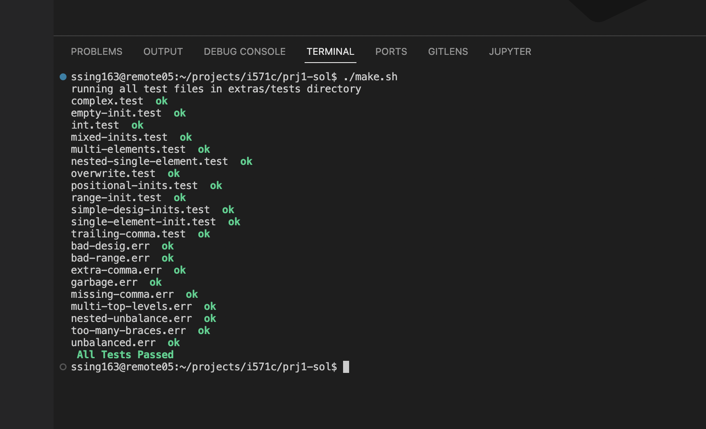

# Student Detail
```
Name:		SHUBHAM KUMAR SINGH
B-Number:	B00955182
Email:		ssing163@binghamton.edu
```
<strong> Project Status: Completed </strong>
# Context Free Grammer
```
    val : INT
        | '{' initializers '}'

    initializers : initializer (',' initializer )* , ?
        | empty

    initializer : '[' INT temp
        | val

    temp: ']' '=' val | '...' INT ']' '=' val
```

# Test Report



# Programming Details

-   Programming Language Used : JavaScript
-   Engine Used: Node JS

# Commands Used To Run Project
```bash
$ cd $HOME/i571c/prj1-sol
$ ./make.sh                                       # Run this bash script to execute all test
$ ./make.sh $HOME/i571c/extras/tests/complex.test # Run this script with
```

-   For getting JSON of <strong>AST / Lexeme</strong>, we need to configure environment variable OUT_TYPE as

```bash
# for getting json ast 
$ export OUT_TYPE="ast"

# for getting lexemes
$ export OUT_TYPE="tokens"
``` 
#

# Reference
[ Ruslan's Blog ](https://ruslanspivak.com/lsbasi-part1/)

[ Ruslan's GitHub ](https://github.com/ghaiklor/pascal-interpreter)


