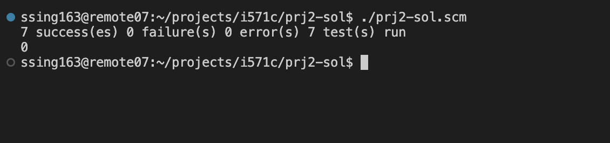

Name:		SHUBHAM KUMAR SINGH
B-Number:	B00955182
Email:		ssing163@binghamton.edu

# Project 2

<strong> Project Status: Completed </strong>

## Test Report

You can find all the test cases moved into TESTS procedure. I have used test-suits module from rackunit to combine all test cases into a single suit.

Below is the screenshot for all the #7 questions test cases passed. Each test case contains multiple check-equal statements.

